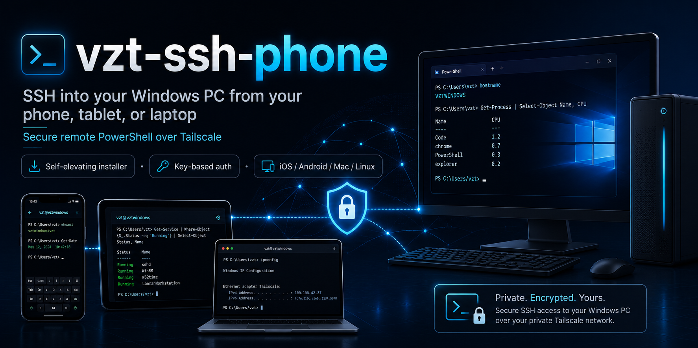

<p align="center">
  
</p>

<h1 align="center">vzt-ssh-phone</h1>

<p align="center">
  <strong>SSH into your Windows PC from your phone, tablet, or laptop — anywhere, securely, with no port-forwarding.</strong>
</p>

<p align="center">
  
  
  
  
  
</p>

---

`vzt-ssh-phone` turns your Windows machine into an SSH server reachable over [Tailscale](https://tailscale.com) (a private, zero-config mesh VPN), with secure key-based login. Once it's running you can open a terminal on your **iPhone, Android, Mac, or any device** and drop straight into a PowerShell session on your PC — perfect for running CLIs like [Claude Code](https://claude.com/claude-code), kicking off `git`/`node`/builds, or checking on long-running jobs while you're away from the machine.

One PowerShell command sets up the whole thing and handles the Windows edge-cases that normally derail this:

- 🛠️ **Self-elevating installer** — you approve a single UAC prompt; it does the rest.
- 🔁 **Resilient OpenSSH install** — uses the built-in Windows package, and automatically falls back to the standalone Microsoft build when a pending reboot would otherwise hang the installer.
- 🔑 **Correct key handling** — including the special locked-down `authorized_keys` file that **administrator** accounts require on Windows.
- 🐚 **PowerShell shell over SSH** — so `claude`, `git`, `node`, etc. are on your `PATH`.
- 🔒 **Private by default** — Tailscale means nothing is exposed to the public internet.

---

## Contents
- [Requirements](#requirements)
- [Quick start](#quick-start)
- [Let an AI agent set it up for you](#let-an-ai-agent-set-it-up-for-you)
- [Connect from your device](#connect-from-your-device) — [iPhone](#-iphone--ipad) · [Android](#-android) · [Mac](#️-macos) · [Linux/Windows](#-linux---another-windows-pc)
- [⚠️ If your login is rejected (Microsoft account / PIN trap)](#️-if-your-login-is-rejected--the-microsoft-account--pin-trap)
- [What you can do once connected](#what-you-can-do-once-connected)
- [Running AI coding CLIs (Claude Code, Codex, …)](#running-ai-coding-clis-claude-code-codex-)
- [How it works](#how-it-works)
- [Options & flags](#options--flags)
- [Verify / health check](#verify--health-check)
- [Managing keys (add / revoke)](#managing-keys-add--revoke)
- [Troubleshooting](#troubleshooting)
- [Security notes](#security-notes)
- [Uninstall](#uninstall)
- [FAQ](#faq)
- [What's in this repo](#whats-in-this-repo)
- [About](#about)
- [License](#license)

---

## Requirements
- **Host:** Windows 10 or 11, with an administrator account (the installer self-elevates).
- **A [Tailscale](https://tailscale.com) account** (free tier is plenty for personal use). You'll sign in on both the PC and each client device.
- **A client device** with an SSH app and the Tailscale app (see [below](#connect-from-your-device)).
- Internet access on the PC for the one-time install.

> **Heads-up on Microsoft accounts:** if you sign into Windows with a Microsoft account, its password is managed online and can't be reset locally — and your **sign-in PIN is _not_ the account password** and won't work over SSH. That's exactly why this tool uses **key authentication** instead of passwords.

---

## Quick start

On the **Windows PC**, open **PowerShell** and run:

```powershell
irm https://raw.githubusercontent.com/vonzelle-vzt/vzt-ssh-phone/main/install.ps1 | iex
```

It self-elevates (approve **one** UAC prompt), installs and configures everything, then opens a browser to log into Tailscale. At the end it prints your connection string:

```
ssh <your-windows-user>@<tailscale-ip>
```

**Recommended one-pass flow** — generate your key on the *client* first, then pass its **public** half so login is fully wired in a single run:

```powershell
# download, then run with your device's PUBLIC key
irm https://raw.githubusercontent.com/vonzelle-vzt/vzt-ssh-phone/main/install.ps1 -OutFile install.ps1
.\install.ps1 -PublicKey "ssh-ed25519 AAAAC3NzaC1... mydevice"
```

> 🔐 You only ever paste a **public** key. The matching private key stays on your device and never travels.

---

## Let an AI agent set it up for you

Already running an AI coding agent in your terminal — **Claude Code, OpenAI Codex, or Gemini CLI**? Just tell it to set this up and it can **take over and do the whole thing**, the same way a human operator would: self-elevate, run headless, poll its own progress, install the CLIs, and hand you back the connection string. You're left with only the handful of steps a human physically must do (approve one UAC prompt, sign into Tailscale, sign into the CLI once).

Tell your agent:

> "Set up vzt-ssh-phone so I can SSH into this PC from my phone — clone https://github.com/vonzelle-vzt/vzt-ssh-phone and follow its AGENTS.md."

The repo ships agent instructions that each tool auto-discovers — **[`AGENTS.md`](AGENTS.md)** (Codex + the cross-agent standard), **[`CLAUDE.md`](CLAUDE.md)** (Claude Code), **[`GEMINI.md`](GEMINI.md)** (Gemini CLI). They drive the **unattended install path**:

```powershell
# what the agent runs for you (elevated, headless, pollable):
$status = "$env:USERPROFILE\vzt-ssh-status.jsonl"
Start-Process powershell -Verb RunAs -ArgumentList @(
  '-NoProfile','-ExecutionPolicy','Bypass','-File','install.ps1',
  '-PublicKey','ssh-ed25519 AAAA... yourphone',
  '-InstallClis','all',            # claude + codex + gemini
  '-StatusFile',$status            # JSONL progress; "<status>.done" appears when finished
)
# ...agent polls "$status.done", then runs verify.ps1 and reports: ssh <user>@<ip>
```

The `-InstallClis` and `-StatusFile` flags exist precisely for this — see [Options & flags](#options--flags).

---

## Connect from your device

Every client needs **two things**: the **Tailscale app** (signed into the *same account* as the PC, toggled on) and an **SSH client**. The PC setup is identical no matter what you connect from — only the client app differs. **Mac and Linux are the easiest**, because `ssh` is already built in.

### 🍎 iPhone / iPad
1. Install **[Tailscale](https://apps.apple.com/app/tailscale/id1470499037)** → sign in (same account) → toggle **ON**.
2. Install an SSH app — **[Termius](https://apps.apple.com/app/termius/id549039908)** or **[Blink Shell](https://blink.sh)**.
3. **Generate the key inside the app** (don't paste one in — it's more secure and avoids import bugs):
   - *Termius:* **Keychain → + → Generate Key** → ED25519, no passphrase → copy its **public** key.
   - *Blink:* `config → Keys → +` → ED25519 → copy public key.
4. Authorize that public key on the PC: `.\install.ps1 -PublicKey "<line>"`, or paste it into `C:\ProgramData\ssh\administrators_authorized_keys`.
5. Add a host → Address `<tailscale-ip>`, username `<your-windows-user>`, select your key → **connect**.
   - *Termius tip:* the key picker lives **inside the Password field** of the host editor, or under **Keychain → Identities**.

### 🤖 Android
1. Install **[Tailscale](https://play.google.com/store/apps/details?id=com.tailscale.ipn)** → sign in → toggle **ON**.
2. Install **[Termius](https://play.google.com/store/apps/details?id=com.server.auditor.ssh.client)**, **JuiceSSH**, or **ConnectBot**.
3. Generate an ED25519 key in the app and copy its **public** key:
   - *ConnectBot:* **Manage Pubkeys → Generate**.
   - *JuiceSSH:* **Identities → new → Generate**.
4. Authorize that public key on the PC (as above).
5. Add the host: `<tailscale-ip>`, your username, attach the key → **connect**.

### 🖥️ macOS
`ssh` is built in, so this is the simplest path.
1. Install Tailscale: `brew install --cask tailscale` (or the [Mac App Store app](https://apps.apple.com/app/tailscale/id1475387142)) → sign in → **ON**.
2. In **Terminal**, generate a key if you don't already have one:
   ```bash
   ssh-keygen -t ed25519 -C "macbook"
   cat ~/.ssh/id_ed25519.pub      # copy this whole line
   ```
3. Authorize that public line on the PC: `.\install.ps1 -PublicKey "<line>"`.
4. Connect:
   ```bash
   ssh <your-windows-user>@<tailscale-ip>
   ```
5. *(Optional)* add a shortcut to `~/.ssh/config`:
   ```
   Host mypc
     HostName <tailscale-ip>
     User <your-windows-user>
   ```
   …then just `ssh mypc`.

### 🐧 Linux / 🪟 another Windows PC
Same as macOS: install Tailscale ([Linux one-liner](https://tailscale.com/download/linux) / [Windows app](https://tailscale.com/download/windows)), run `ssh-keygen -t ed25519`, authorize the `.pub` line on the host, then:
```bash
ssh <your-windows-user>@<tailscale-ip>
```

---

## ⚠️ If your login is rejected — the Microsoft-account / PIN trap

This is the **single most common reason a fresh setup won't connect**, and it's worth understanding because the error is misleading. The connection *succeeds*, then authentication fails:

```
Permission denied (publickey,password,keyboard-interactive)
```

…and every password you try gets rejected. Here's the real story — and the fix that actually gets you in.

### Why it happens
If you sign into Windows with a **Microsoft account** (most personal PCs do):
- **Your sign-in PIN is _not_ your account password.** A PIN only unlocks the device locally — SSH can't use it. Typing your PIN as the SSH password will always fail.
- **The account password is managed online** by Microsoft. It can't be reset locally (`net user <you> <pw>` returns **System error 8646** — *"the system is not authoritative for this account"*), and it's frequently not something you actually remember typing.

So password login is effectively a dead end. **The thing that gets you connected is key authentication — adding your device's key as an authorized identity on the PC.**

### The fix that works (step by step)
1. **Generate a key on your client device** (don't reuse one):
   - Phone SSH app → *Generate Key → ED25519* (no passphrase).
   - Mac/Linux → `ssh-keygen -t ed25519`.
2. **Copy the PUBLIC key** — the `ssh-ed25519 AAAA… ` line (never the private one).
3. **Authorize it on the PC** by re-running the installer with it:
   ```powershell
   .\install.ps1 -PublicKey "ssh-ed25519 AAAA… mydevice"
   ```
   > 🧷 **Admin-account gotcha:** if your Windows user is an **administrator**, the key must live in `C:\ProgramData\ssh\administrators_authorized_keys` with an ACL locked to `SYSTEM` + `Administrators` — **not** the usual `~\.ssh\authorized_keys`. Dropping an admin's key in the normal file silently does nothing and you'll keep getting *Permission denied*. The installer puts it in the right place automatically; this is the detail that trips people up when they do it by hand.
4. **Point your SSH app at that key** as its login identity (Termius: it's inside the host's **Password field**, or under **Keychain → Identities**) and connect.

Now login uses the **key**, the password prompt is skipped entirely, and you're in — **no Microsoft password and no PIN required.** This is exactly the path that resolved a real "I only know my PIN" setup.

> 💡 Prefer generating the key **on the client** (not on the PC) so the private key never travels — the PC only ever holds the public half.

---

## What you can do once connected
You land in a **PowerShell** session on the PC, as your normal user, with your `PATH` intact. From your phone or laptop you can:
- Run AI coding agents — **[Claude Code](https://claude.com/claude-code)** (`claude`), **OpenAI Codex** (`codex`), and others (see [below](#running-ai-coding-clis-claude-code-codex-)).
- Drive `git`, `node`, `npm`, `python`, builds, tests — anything that's normally on your `PATH`.
- Navigate and edit files, tail logs, restart services, check on long-running jobs.
- Kick something off, disconnect, and reconnect later — the PC keeps running.

---

## Running AI coding CLIs (Claude Code, Codex, …)
Reaching any CLI over SSH is **identical** — you connect once, then type the command. `claude`, `codex`, and friends all work the exact same way; SSH doesn't care which one you run. The only per-tool requirement is that it's **installed and signed in on the PC**.

**Install on the PC (one time, in PowerShell):**
```powershell
npm install -g @anthropic-ai/claude-code   # Claude Code    ->  run with: claude
npm install -g @openai/codex               # OpenAI Codex   ->  run with: codex
npm install -g @google/gemini-cli          # Google Gemini  ->  run with: gemini
```
*(All need [Node.js](https://nodejs.org) — already present if you can run `npm`.)*

**Sign in once — do this while you're physically at the PC.** First-run authentication opens a **browser**, which appears on the PC's own screen, not your phone:
```powershell
claude      # complete the login prompt once
codex       # complete the login prompt once
gemini      # complete the Google login prompt once
```
After that, each tool caches its credentials in your home folder (e.g. `~\.claude`, `~\.codex`), so **every later SSH session from your phone just works** — type `claude` or `codex` and go.

> Same recipe for any terminal tool (`aider`, `gh`, `git`, …): install it on the PC, authenticate once locally, then run it over SSH like anything else. If a tool *only* authenticates via browser and you've never signed in locally, do that one-time login at the PC first.

---

## How it works
```
  client device                 Tailscale mesh                  Windows PC
 (phone / Mac / …)  ── encrypted ──►  (private network,   ──►  OpenSSH sshd ──► PowerShell
  SSH app + key        WireGuard       no public IP)            :22, key auth     (claude / git / node)
```
- **OpenSSH server** installs to `C:\Program Files\OpenSSH`, runs as the `sshd` service, auto-starts on boot.
- **Authorized keys:** admin accounts → `C:\ProgramData\ssh\administrators_authorized_keys` (ACL locked to `SYSTEM` + `Administrators`, as Win32-OpenSSH requires). Standard accounts → `%USERPROFILE%\.ssh\authorized_keys`.
- **Default SSH shell** is set to PowerShell via `HKLM:\SOFTWARE\OpenSSH\DefaultShell`.
- **Firewall** gets an inbound TCP rule for the SSH port.
- **Tailscale** gives the PC a stable private `100.x.y.z` address that follows it across networks — so the same `ssh` command works from home, a café, or cellular.

---

## Options & flags
`install.ps1` accepts:

| Flag | Default | Description |
|---|---|---|
| `-PublicKey "<line>"` | — | SSH **public** key line to authorize (e.g. `ssh-ed25519 AAAA... phone`). |
| `-SkipTailscale` | off | Don't install/start Tailscale (e.g. you only need LAN access). |
| `-Port <n>` | `22` | SSH port. Also updates `sshd_config` and the firewall rule. |
| `-InstallClis "<list>"` | — | Also install AI CLIs: `claude`, `codex`, `gemini`, a comma list, or `all`. |
| `-StatusFile "<abs path>"` | — | Stream JSONL progress + write `<path>.done` on finish, so an [AI agent](#let-an-ai-agent-set-it-up-for-you) can run this unattended and poll it. |

Examples:
```powershell
.\install.ps1 -PublicKey "ssh-ed25519 AAAA... laptop"
.\install.ps1 -SkipTailscale            # LAN-only
.\install.ps1 -Port 2222                # custom port
```

The installer is **idempotent** — safe to re-run. It skips anything already done and just adds what's missing (e.g. authorizing an additional device's key).

---

## Verify / health check
Run anytime (after a reboot, a Windows update, or just to confirm) — it's read-only and prints your connection string:
```powershell
irm https://raw.githubusercontent.com/vonzelle-vzt/vzt-ssh-phone/main/verify.ps1 | iex
```
It reports the status of the `sshd` service, port listener, firewall rule, default shell, authorized-keys file, and Tailscale.

---

## Managing keys (add / revoke)
Keys live in `C:\ProgramData\ssh\administrators_authorized_keys` (admin accounts) — one public key per line.

- **Add another device:** re-run `install.ps1 -PublicKey "<new public key>"`, or append the line to that file.
- **Revoke a lost/old device:** delete its line from that file.
- **No restart needed** — `sshd` reads the file fresh on every new connection.

> Editing that file requires an **elevated** editor (its ACL is restricted to `SYSTEM` + `Administrators`).

---

## Troubleshooting
| Symptom | Fix |
|---|---|
| `Private Key is empty` (Termius) | The key wasn't attached. Generate it **in the app** and select it on the host (Termius: tap the Password field → pick the key). |
| `Permission denied (publickey,password,...)` | Your public key isn't authorized, or you're an admin user and it's in the wrong file. Re-run `install.ps1 -PublicKey "<line>"`. |
| `Connection refused` | `sshd` is stopped. On the PC: `Start-Service sshd`. |
| Can't reach the `100.x` address | Tailscale is off on the client or PC, or not the same account. Toggle it on; on PC: `& 'C:\Program Files\Tailscale\tailscale.exe' status`. |
| Sign-in **PIN** doesn't work over SSH | A Windows PIN is **not** the account password and can't be used over SSH. Use key auth (the default here). |
| Microsoft-account PC, password won't reset | Expected — MS-account passwords are managed online (`net user` → *error 8646*). Use key auth. |
| `Add-WindowsCapability: Class not registered` | A PowerShell 7 quirk. The installer uses DISM / the standalone build instead — safe to ignore. |
| DISM hangs at ~0% CPU during install | A **pending reboot** is blocking it. The installer auto-detects this and switches to the standalone build. |

---

## Security notes
- **Tailscale-only by default.** Your SSH port is not exposed to the public internet — this is the primary protection. If you choose to port-forward to the open internet instead, use a strong key, **disable password auth**, consider a non-standard port, and add brute-force protection.
- **Key auth, not passwords.** The private key stays on your device; the PC stores only the public half.
- **Generate keys on the client** so the private key never travels.
- **No secrets in this repo.** Example keys in the docs are truncated placeholders. `.gitignore` blocks committing any `*_key`, `id_*`, `*.pem`, or logs.

---

## Uninstall
```powershell
# Run in an elevated PowerShell
Stop-Service sshd -ErrorAction SilentlyContinue
& 'C:\Program Files\OpenSSH\uninstall-sshd.ps1'           # if installed via the standalone build
Remove-WindowsCapability -Online -Name OpenSSH.Server~~~~0.0.1.0  # if installed via the Windows capability
Remove-NetFirewallRule -Name 'OpenSSH-Server-In-TCP' -ErrorAction SilentlyContinue
Remove-Item 'HKLM:\SOFTWARE\OpenSSH' -Recurse -ErrorAction SilentlyContinue
# Tailscale: uninstall from Apps & Features, or:  winget uninstall Tailscale.Tailscale
```

---

## FAQ
**Does this work the other way — SSH _from_ Windows _to_ a Mac/phone?**
No. This sets up the **Windows PC as the server** (the thing you connect *to*). You connect *from* any OS.

**Do I need to open ports on my router?**
No — that's the point of Tailscale. Nothing is exposed publicly.

**Will it keep working after I reboot?**
Yes. `sshd` and Tailscale both auto-start. Just reconnect.

**Can I use a password instead of a key?**
Only if your account has a real local password (many don't — see the Microsoft-account note). Key auth is recommended and is what the installer wires up.

**Is it safe to re-run the installer?**
Yes — it's idempotent. Re-run it to add a new device's key or repair the setup.

---

## What's in this repo
| File | Purpose |
|---|---|
| [`install.ps1`](install.ps1) | Self-elevating, idempotent installer — SSH server (with standalone fallback), firewall, PowerShell shell, key authorization, Tailscale, and optional AI CLIs. |
| [`verify.ps1`](verify.ps1) | Read-only health check; prints your `ssh <user>@<ip>` connection string. |
| [`AGENTS.md`](AGENTS.md) | Agent-takeover playbook — how an AI CLI drives the whole install unattended (Codex + the cross-agent standard). |
| [`CLAUDE.md`](CLAUDE.md) · [`GEMINI.md`](GEMINI.md) | Thin pointers so Claude Code and Gemini CLI auto-discover `AGENTS.md`. |
| `README.md` | This guide. |
| `assets/banner.png` | Project banner. |
| `LICENSE` | MIT. |

---

## About
**`vzt-ssh-phone`** turns a Windows PC into a secure, key-authenticated SSH target you can reach from any device over a private Tailscale network — with a one-command installer, an AI-agent takeover mode, and built-in support for running Claude Code, Codex, and Gemini from your phone.

Built and maintained by **[VZT Tech Consulting](https://github.com/vonzelle-vzt)**. Issues and pull requests welcome. If it saved you a headache, a ⭐ is appreciated.

---

## License
MIT © 2026 VZT Tech Consulting — see [LICENSE](LICENSE). Provided as-is; review the scripts before running. You are responsible for securing access to your own machine.
